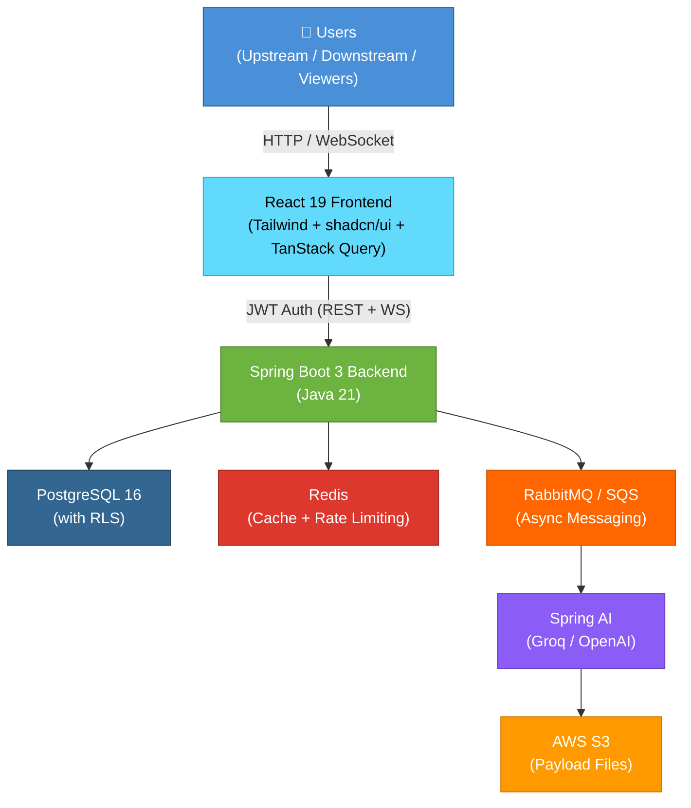

# Project-Nexus – High-Level Architecture Design Document (ADD)

**Project Name**: Project-Nexus  
**Version**: 1.0 (MVP)  
**Date**: April 20, 2026  
**Author**: Chelsea Scott
**Target Role**: Software Engineer II – Multi-tenant SaaS Applications (Aerospace)  
**Status**: Approved – Aligned with BRD.md v1.0  

**Single Source of Truth**: This document is derived directly from `BRD.md`. It enforces the **clean separation of concerns** between the three core layers and all MVP functional/non-functional requirements.

---

## 1. Executive Summary & Architectural Vision

**Project-Nexus** is a **multi-tenant SaaS Data Collaboration Platform** that acts as an intelligent “middleman” between upstream data producers and downstream consumers in aerospace-style engineering environments.

It implements **modern Data Mesh principles** with strict **clean architecture**:
- **Upstream ownership** of Data Contracts (governance & validation)
- **Downstream ownership** of Alignment Expectations (goal alignment & monitoring)
- **Shared execution layer** for Tasks & Workflows with AI-driven proactivity

The architecture prioritizes:
- **Strict multi-tenancy** with tenant isolation at every layer
- **Auditability & traceability** (critical for aerospace safety/compliance)
- **Extensibility** while keeping the MVP simple and production-grade
- **AI context-awareness** (contracts + expectations + payload history)

**Core Architectural Style**: Layered Clean Architecture (hexagonal / ports-and-adapters) + Domain-Driven Design (DDD) bounded contexts for the three major layers.

---

## 2. High-Level System Architecture

### 2.1 System Overview

Project-Nexus consists of the following major components:

- **Frontend**: React 19 Single Page Application (SPA)
- **Backend**: Spring Boot 3 (Java 21) REST API + WebSocket
- **Database**: PostgreSQL 16 with Row Level Security (RLS) for tenant isolation
- **Cache**: Redis for published contracts, active expectations, and rate limiting
- **Async Messaging**: RabbitMQ (or AWS SQS) for payload ingestion and AI processing
- **AI Layer**: Spring AI integrated with Groq or OpenAI for context-aware deviation detection and task suggestion
- **Storage**: AWS S3 for raw payload files

**High-Level Component Diagram**:



### 2.2 Core Layers (Strict Separation of Concerns)

| Layer                          | Ownership          | Key Entities                                      | Responsibilities |
|--------------------------------|--------------------|---------------------------------------------------|------------------|
| **Data Contracts**             | Upstream teams     | `DataContract`, `TestVariable`, `BusinessGoal`    | Self-service publishing, versioning, schema definition, validation rules |
| **Goal Alignment & Monitoring**| Downstream teams   | `AlignmentExpectation`, `Deviation`               | Define expectations against published contracts, monitor every payload against contract + expectations |
| **Tasks & Workflows**          | Cross-team         | `Task`, `Comment`, `KanbanBoard`                  | Kanban-style task management, AI-suggested tasks linked to contracts/payloads/deviations, real-time collaboration |

**Key Principle**: Strict separation — no direct coupling between layers. All interactions occur through well-defined service interfaces and domain events.

---

## 3. Multi-Tenancy Strategy (Enterprise-Grade)

- **Tenant Model**: Every entity includes a mandatory `tenant_id` (UUID).
- **Database Isolation**:
  - PostgreSQL **Row Level Security (RLS)** policies on all tables.
  - Default policy: `tenant_id = current_setting('app.current_tenant')`.
  - Spring Boot sets the tenant context from JWT claims on every request.
- **Authentication**: JWT tokens containing `tenant_id`, `user_id`, and roles. Automatic tenant provisioning on first signup.
- **Sharing**: Cross-tenant access only via explicit `DataContract.sharingRules` (controlled by upstream owner).
- **Auditability**: All tables include `created_by`, `updated_by`, `created_at`, `updated_at`, `tenant_id`.

---

## 4. Data Model – High-Level Entities (MVP)

All entities extend `BaseTenantEntity` (contains `tenantId`, audit fields, and soft-delete support).

**Core Entities**:

```java
// Data Contracts Layer
@Entity
class DataContract {
    UUID id;
    UUID tenantId;
    String name;
    String description;
    ContractStatus status;           // DRAFT / PUBLISHED
    JsonNode businessGoals;          // flexible JSONB
    List<TestVariable> testVariables;
    List<SharingRule> sharingRules;
}

// Goal Alignment & Monitoring Layer
@Entity
class AlignmentExpectation {
    UUID id;
    UUID tenantId;
    UUID dataContractId;
    String name;
    String description;
    Severity severity;               // WARNING / CRITICAL
    String ruleExpression;           // structured rule (JSON / CEL / SpEL)
}

// Ingestion & Monitoring
@Entity
class Payload {
    UUID id;
    UUID tenantId;
    UUID dataContractId;
    JsonNode rawPayload;             // JSONB
    PayloadStatus status;
    String s3Key;                    // reference to AWS S3
}

// Tasks & Workflows Layer
@Entity
class Task {
    UUID id;
    UUID tenantId;
    String title;
    String description;
    TaskStatus status;
    UUID assigneeId;
    LocalDateTime dueDate;
    LinkType linkedToType;           // CONTRACT / PAYLOAD / DEVIATION
    UUID linkedToId;
}
```

**Storage Strategy**:
- PostgreSQL: structured data + JSONB for flexible schema, payloads, and rules
- Redis: caching of published contracts and active expectations
- AWS S3: raw payload file storage (metadata kept in DB)

---

## 5. Critical Data Flow – Payload Ingestion

1. Upstream team submits payload via REST API (`POST /api/v1/payloads`)
2. Synchronous basic validation against the latest published `DataContract`
3. Payload is sent asynchronously to the message queue
4. **Ingestion Processor** (async):
   - Full validation against the Data Contract **and** all active `AlignmentExpectation`s
   - Persists `Payload` and any `Deviation` records
5. **AI Deviation Detector** (Spring AI) receives rich context:
   - Full contract (goals + variables)
   - All active expectations
   - Current payload data
   - Recent historical trends
6. If deviations are detected → **AI Task Suggester** creates or recommends linked `Task`(s)
7. Real-time WebSocket notification sent to relevant teams

---

## 6. Key Design Patterns & Technical Decisions

| Area                  | Decision                                      | Rationale |
|-----------------------|-----------------------------------------------|---------|
| Backend Architecture  | Clean Architecture + DDD Bounded Contexts     | Strict separation of Data Contracts / Alignment / Tasks |
| Project Structure     | Multi-module Maven/Gradle                     | Clear ownership boundaries |
| API                   | REST + OpenAPI + Spring WebSocket             | Modern, documented, real-time |
| Async Processing      | RabbitMQ (or AWS SQS) + Spring Events         | Decoupled and scalable |
| AI Integration        | Spring AI (Groq / OpenAI) with structured prompts | Context-aware features |
| Security              | Spring Security + JWT + PostgreSQL RLS        | Enterprise-grade multi-tenancy |
| Caching               | Redis + Spring Cache                          | High performance for hot paths |
| Observability         | Structured JSON logging + Micrometer          | Production readiness |

---

## 7. Non-Functional Highlights

- **Security & Compliance**: Full tenant isolation, audit trail on all mutations, encryption at rest
- **Performance**: Async heavy paths, Redis caching, efficient JSONB queries
- **Scalability**: Stateless services, horizontal scaling, event-driven core
- **Reliability**: Idempotent processors, retry queues, Resilience4j support

---

## 8. Out of Scope for MVP (per BRD)

- Multi-level approval workflows for expectations
- Full data lineage visualization
- Rich BI-style dashboards and visualizations
- Real-time streaming ingestion
- Billing / subscription management
